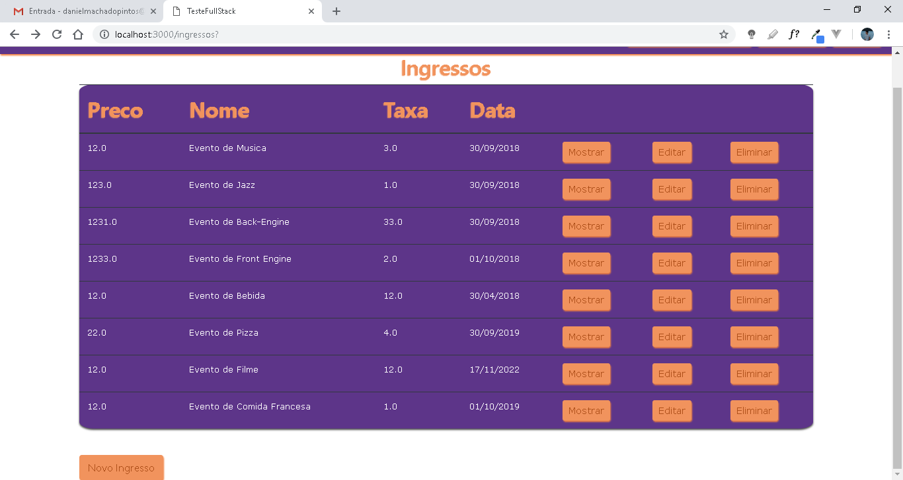

# **O que foi pedido para o** Teste Ruby On Rails Social Wave

### Descrção da aplicação
A aplicação tem como objetivo a criação e venda de ingressos, e deve utilizar as seguintes tecnologias :
* [Ruby On Rails](http://api.rubyonrails.org/)
* [Html, Css](https://www.w3schools.com/)

### Requisitos da aplicação
A aplicação deve permitir a criação, atualização, exclusão e visualização utilizando os padrões
estabelecidos pelo framework Ruby On Rails.

* Os dados devem ser persistidos em um banco de dados Open Source.

* Um comprador deve poder comprar ingressos.

* Todos os campos dos ingressos e do pedido são necessários.

* Devem ser listados para venda somente os ingressos que tiverem data >= a data atual.

### Objetos da Aplicação

A aplicação deverá conter os seguintes objetos:
* Ingresso
  * Preço(float)
  * Nome(string)
  * Taxa(float)
  * Data(datetime)
* Comprador
  * Nome(string)
  * Email(string)
  * Telefone(float)
* Pedido
  * * Comprador
  * Ingresso
  * pago(boolean)

### Coisas que queremos ver

* Código limpo e legível
* Utilização das funcionalidades e geradores do Rails
* Projeto que respeite a arquitetura do Rails

### Diferenciais

* Telas bonitas(utilizando bootstrap, preferencialmente)
* Validações Inteligentes
* Utilização correta do ActiveModel
* Versionamento GIT
* Novas Funcionalidades

### Considerações
Para a conclusão do teste deverá ser enviado um link para o repositório GIT público para o email: jian@socialwave.com.br.

--------------------


# O que foi entregue:

> " Eu tentei imitar a identidade visual do site `social Wave` "

os caminhos encontrado no sistema pode ser definido como 3 principais:
1. `http://localhost:3000/ingressos` - esse é o caminho para os _CRUD_ dos ingressos
2. `http://localhost:3000/compradors` - esse é o caminho para os usuários da aplicação
  * como eu fiz um atributo de sessão. Não coloquei visível no layout  _"padrão"_ do usuário final.

  * mas a __rota existe__.

  * em uma segunda parte da aplicação pode ser definido também um bloqueio através do `cancancan`

3. `http://localhost:3000/pedidos` - essa é a rota **principal** do usuário, onde ele irá poder navegar.

### @algumas telas

Para explicar o sistema vou exemplificar com telas:


###### Primeira tela

> a primeira tela que o usuário irá encontrar será a tela de login


###### Tela de Cadastro

> caso o usuário não esteja cadastrado no sistema


###### Tela Principal

> essa tela sera onde o usuário poderá fazer as aquisição dos pedidos. Ou onde ele irá comprar os ingressos.  


###### Tela Ingresso

> essa parte é onde o usuário irá inserir um novo ingresso.




###### Novo Pedido

> Para um novo pedido do usuário, como o usuário só pode escolher um pedido existe no banco de dados, eu quis colocar um select, para o que usuário saiba qual são os ingressos(evento a venda)


> o usuário fazendo select


### Esses foram os geradores de código

Aqui são um pouco da parte de geração de código do rails, para poder incializar a aplicação. Tive que dar uma pesquisada como funcionava certinho a parte do `devise`.

```
rails g scaffold Comprador nome:string telefone:string admin:boolean
rails g scaffold Ingresso preco:float nome:string taxa:float data:datetime
rails g scaffold Pedido comprador:references ingresso:references pago:boolean

rails g devise:install
rails g devise Comprador


rails g cancan:ability
```
